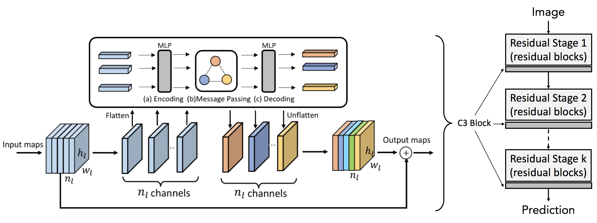
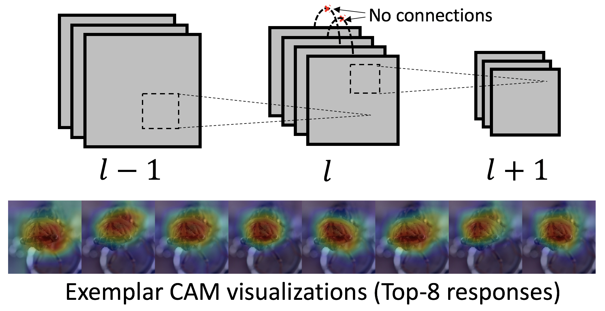

# C3Net
Pytorch implementation of our NeurIPS 2019 paper ["Cross-channel Communication Networks"](https://papers.nips.cc/paper/8411-cross-channel-communication-networks.pdf)

## Introduction

As shown above, the motivation behind our proposed C3Net is that:

* Neurons at the same layer do not directly interact with each other.
* Different neurons might respond to the same patterns and locations.

In this paper, we mainly focus on convolutional neural networks (CNN). In CNN, channel responses naturally encodes which pattern is at where. Our main idea is to enable channels at the same layer to communicate with each other and then calibrate their responses accordingly. We want different filters learn to focus on different useful patterns, so that they are complementary to each other.

The main contributions are:

* We proposed cross-channel communication (C3) block to enable full interactions across channels at the same layer.
* It achieved better performance on image classification, object detection and semantic segmentation.
* It captured more diverse representations with light-weight networks.
